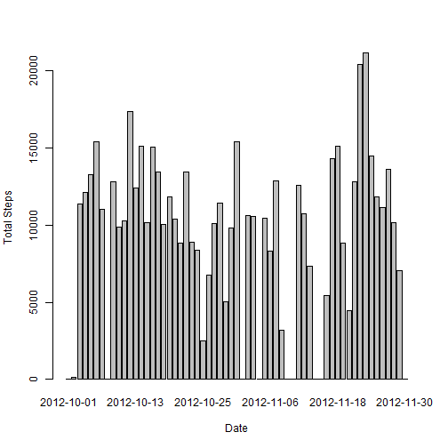
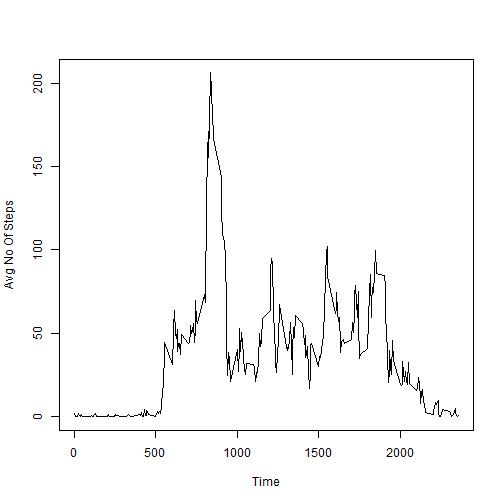
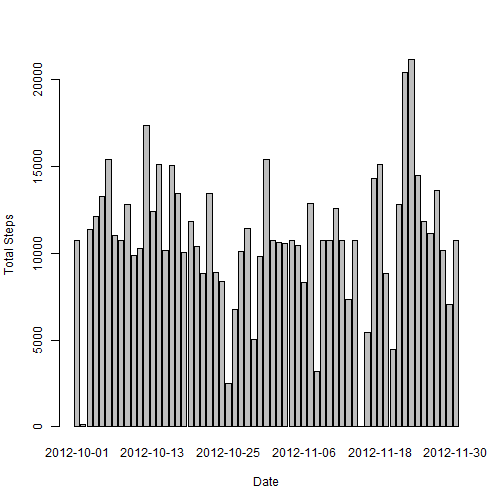
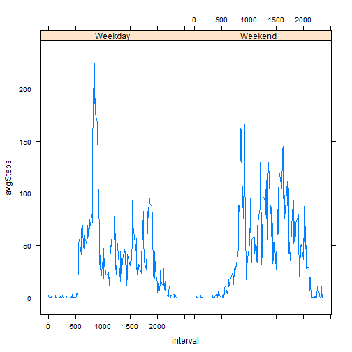

## Course Project 1

#### Question 1
The following line of code reads the data for the assignment

```r
data <- read.csv("repdata/activity.csv")
```

#### Question 2
The following code snippet plots a histogram with the date on x axis and the total number of steps taken on that day on the y axis.


```r
rawdata <- read.csv("repdata/activity.csv")
data <- rawdata[!is.na(data$steps),]
stepsperday <- tapply(data$steps, data$date, sum)
stepsperday[is.na(stepsperday)] <- 0
steps <- data.frame(steps = stepsperday, date = as.Date(names(stepsperday)))
barplot(steps$steps, names.arg = steps$date, xlab = "Date", ylab = "Total Steps")
```



#### Question 3
The following 2 lines of code computes the mean and median number of steps taken on each day.


```r
meansteps <- mean(steps$steps)
mediansteps <- median(steps$steps)
```
The mean number of steps per day is 9354.2295082  
The median number of steps per day is 1.0395 &times; 10<sup>4</sup>

#### Question 4  
To get the time series plot of the average number of steps per interval, we use the tapply function to group the data based on the intervals and then apply the mean function. Then we use this data to make the time series plot.


```r
avg_stepsperinterval <- tapply(data$steps, data$interval, mean)
intervals <- names(avg_stepsperinterval)
plot(intervals, avg_stepsperinterval, type = "l", ylab = "Avg No Of Steps", xlab = "Time")
```




#### Question 5
The following code snippet can be used to find the interval with the maximum averate number of steps

```r
names(which.max(tapply(data$steps, data$interval, mean)))
```

```
## [1] "835"
```

#### Question 6
The total number of missing values in the data set can be computed the following way

```r
no_of_nas <- sum(is.na(rawdata$steps))
```

Total number of na values in the dataset is 2304    
We will use mean for the time interval to impute the missing values. We create a new dataset with the missing values filled in the following way.

```r
intervalmeans <- tapply(rawdata$steps, rawdata$interval, mean, na.rm = TRUE)
newdata <- rawdata
len <- nrow(newdata)
for (i in 1:len) {
  if (is.na(newdata[i, "steps"])) {
    newdata[i,"steps"] <- intervalmeans[[as.character(newdata[i, "interval"])]]
  }
}
```

Now we again plot the total number of steps per day histogram  
We will use the same code as before but will use newdata as the dataset.  

```r
stepsperday <- tapply(newdata$steps, newdata$date, sum)
steps <- data.frame(steps = stepsperday, date = as.Date(names(stepsperday)))
barplot(steps$steps, names.arg = steps$date, xlab = "Date", ylab = "Total Steps")
```



We can see that unlike the first plot, there are no gaps in this plot.

Now we recalculate the mean and median of total number of steps taken per day. 

```r
meansteps <- mean(steps$steps)
mediansteps <- median(steps$steps)
```
The mean number of steps per day is 1.0766189 &times; 10<sup>4</sup>  
The median number of steps per day is 1.0766189 &times; 10<sup>4</sup>

We can see that both numbers have gone up. We can infer that most of the missing values were in intervals where there were heavy activity on other days.  

#Question 7
To find if there is a difference in the activity pattern on weekends and weekdays we first add a factor variable to the dataset which determines whether an observation was made on a weekday or not.


```r
newdata$date <- as.Date(newdata$date)
newdata$day <- weekdays(newdata$date)
newdata$weekend <- lapply(newdata$day, function(x) {
  if(x %in% c("Saturday", "Sunday")) {
    "Weekend"
  } else {
    "Weekday"
  }
})
newdata$weekend <- as.factor(as.character(newdata$weekend))
newdata$interval <- as.factor(newdata$interval)
```

Now we create a panel plot with separate plots for weekends and weekdays.  

```r
library(lattice)
library(reshape2)
intervalmean <- with(newdata, tapply(steps, list(weekend,interval), mean))
intervalmean <- melt(intervalmean)
colnames(intervalmean) <- c("weekend", "interval", "avgSteps")
xyplot(avgSteps ~ interval | weekend, data = intervalmean, type = "l")
```


